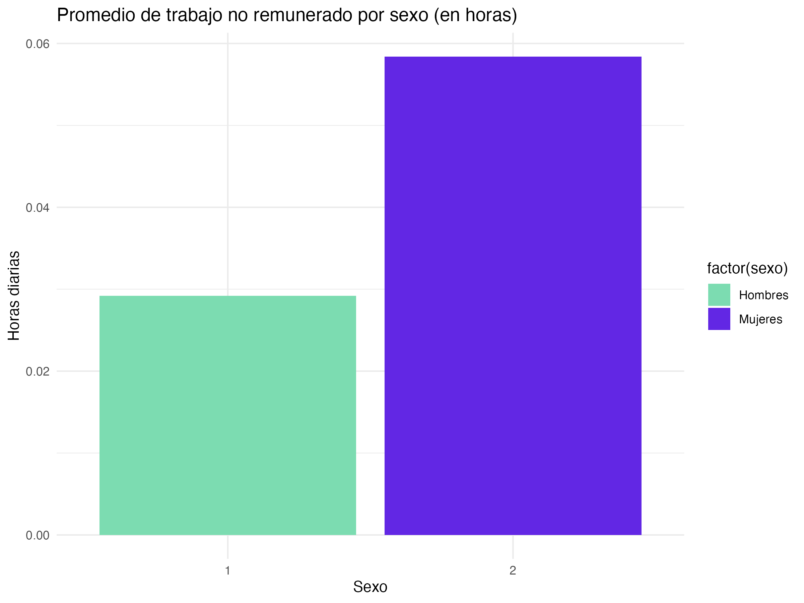
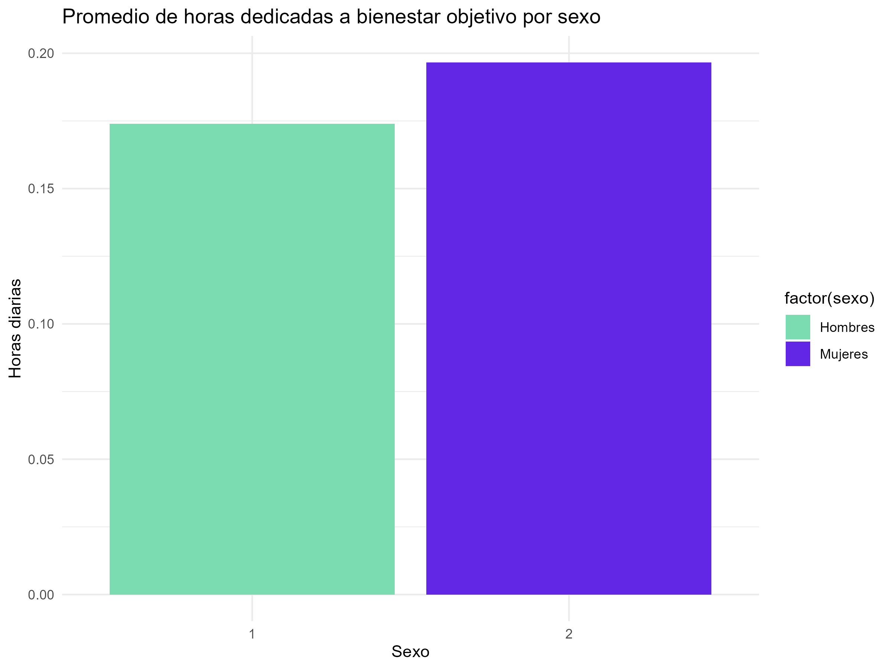
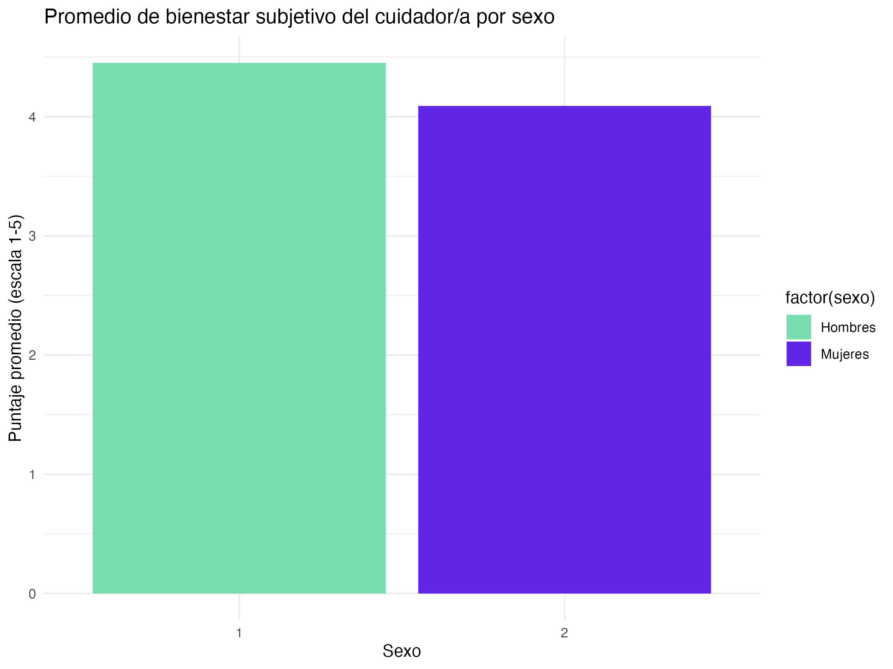
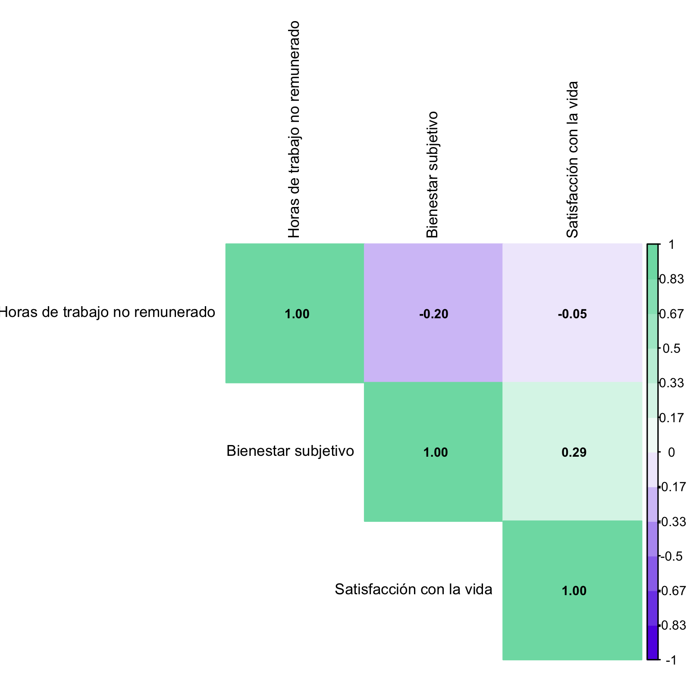
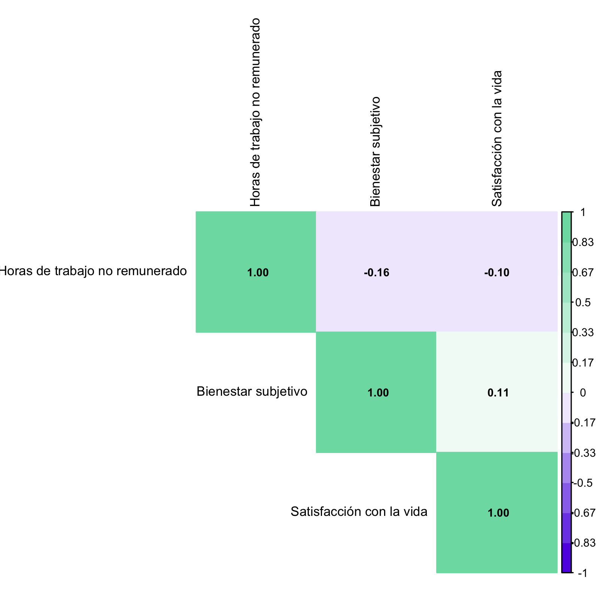

---
title: "Resultados"
---
Interpreta resultados, limitaciones y aportes.

## Resultados

En primer lugar, para las horas promedio en un día que los adultos mayores dedican al trabajo de cuidados no remunerado, el mínimo de la muestra fue 0 horas, mientras que el máximo fue de 23.4 horas, aunque el promedio de horas gastadas fue de 2.75. Con respecto a las horas dedicadas al bienestar objetivo, lo mínimo se encuentra en 0 horas, mientras que lo máximo en 24, aunque la media está en 11.31 horas. Por otro lado, con respecto al bienestar subjetivo en cuidadores, el promedio de esta escala es 4.17, lo cual se ubica entre “Casi nunca”, y “Nunca”, lo que en general, refiere a que los cuidadores no perciben que sus labores de cuidados tengan muchos efectos negativos sobre ellos.  

Con respecto al promedio de trabajo no remunerado por sexo, se evidencia que, incluso para adultos mayores, las mujeres toman mayor carga de trabajo de cuidados no remunerado, dedicando en promedio más del doble de las horas que dedican los hombres, como se puede ver en la @fig-tnr-sexo. Los promedios del resto de variables e indicadores según sexo pueden examinarse en la @fig-cpaf-sexo y en la @fig-bsc-sexo respectivamente.

::: {#fig-descriptivos-sexo layout-ncol=3}

{#fig-tnr-sexo}

{#fig-cpaf-sexo}

{#fig-bsc-sexo}

Análisis descriptivo y comparativo de medias según el sexo reportado.
:::

En segundo lugar, en la muestra completa, es decir, todos los adultos mayores, la correlación entre horas de trabajo de cuidados no remunerado y bienestar objetivo es de 0.467 (_p-value_ < 0.01), por lo que es estadísticamente significativa con un 99% de confianza, es una correlación de intensidad mediana, y es positiva, lo que quiere decir que mientras más horas de trabajo de cuidados no remunerados, hay un mayor bienestar objetivo en los adultos mayores. Por otro lado, la correlación entre horas de trabajo de cuidados no remunerado y satisfacción con la vida es de -0.028 (_p-value_ < 0.01), por lo que es estadísticamente significativa con un 99% de confianza, muy pequeña en intensidad, y negativa, que significa que mientras más horas de trabajo de cuidados no remunerado, hay una menor satisfacción con la vida.

Sin embargo, se percibe una diferencia entre la muestra completa al filtrar por quienes son específicamente cuidadores (de niños y de personas en situación de dependencia funcional). Para el grupo total de personas cuidadoras, estas dinámicas de asociación cruzada se encuentran sintetizadas visualmente en el mapa de calor de la @fig-corr-cuidadores. 

Para la correlación entre horas de trabajo no remunerado y bienestar objetivo en este subgrupo, esta es de -0.055 (_p-value_ = 0.09), por lo que, aunque muestre una gran diferencia al resultado de la muestra completa, ya que la correlación es negativa, es decir, que a mayor cantidad de horas de trabajo de cuidados no remunerados los cuidadores presentarían un menor bienestar objetivo, no es estadísticamente significativa, ya que el intervalo de confianza pasa por 0.  

Por otra parte, la correlación entre horas de trabajo de cuidados no remunerado y bienestar subjetivo de cuidadores es de -0.207 (_p-value_ < 0.01), la asociación es estadísticamente significativa con un 99% de confianza, pequeña y negativa, que quiere decir que a mayor cantidad de horas de trabajo de cuidados no remunerado, los cuidadores presentan también un menor bienestar subjetivo. Por último, entre horas de trabajo de cuidados no remunerado y satisfacción con la vida la asociación es de -0.070 (_p-value_ < 0.05), por lo que es estadísticamente significativa con un 95% de confianza, muy pequeña, y negativa, es decir, que a mayor cantidad de horas de trabajo de cuidados no remunerados, hay una menor satisfacción con la vida en cuidadores.  

{#fig-corr-cuidadores width=70%}

Si se filtra por mujeres cuidadoras, quienes son el 75% de los cuidadores en total (cuyo mapa estructural corresponde a la @fig-corr-mujeres), la asociación entre horas de trabajo de cuidados no remunerado y bienestar objetivo arroja una correlación de -0.095 (_p-value_ < 0.05), por lo que es estadísticamente significativa con un 95% de confianza, y no presenta transformaciones a la asociación entre estas variables en la muestra total de cuidadores. Es, además, una correlación muy pequeña y negativa, lo que quiere decir que a mayor cantidad de horas de trabajo de cuidados no remunerado, menor bienestar objetivo.  

Luego, entre horas de trabajo de cuidados no remunerado y bienestar subjetivo de cuidadores es de -0.198 (_p-value_ < 0.01), por lo que es estadísticamente significativa con un 99% de confianza, es pequeña, y negativa, que significa que a mayor cantidad de horas de trabajo, menor bienestar subjetivo. Por último, entre horas de trabajo de cuidados no remunerado y satisfacción con la vida la correlación es de -0.053 (_p-value_ < 0.05), por lo que es estadísticamente significativa con un 99% de confianza, muy pequeña, y negativa, por lo que a mayor horas de trabajo de cuidados no remunerado menor satisfacción con la vida. 

Finalmente, para los hombres la asociación entre horas de trabajo de cuidados no remunerado y bienestar objetivo la correlación es de 0.124 (_p_ = 0.07), pero no es estadísticamente significativa, porque su intervalo de confianza pasa por 0, entonces, a pesar de ser muy pequeña y positiva, no es posible afirmar que a mayor horas de trabajo de cuidados no remunerado, hay mayor bienestar objetivo. El desglose completo de estas intensidades para el sexo masculino se aprecia en la @fig-corr-hombres.

Entre horas de trabajo de cuidados no remunerado y bienestar subjetivo la asociación es de -0.157 (_p-value_ < 0.05), es estadísticamente significativa con un 95% de confianza, pequeña, y negativa, lo que significa que a mayor cantidad de horas de trabajo menor bienestar subjetivo. Por último, entre horas de trabajo de cuidados no remunerado y satisfacción con la vida la correlación es de -0.104 (_p-value_ < 0.05), por lo que es estadísticamente significativa con un 95% de confianza, es muy pequeña, y negativa, que sugiere que a mayor cantidad de horas de trabajo de cuidados no remunerados, menor satisfacción con la vida de los cuidadores hombres. 

::: {#fig-correlaciones-genero layout-ncol=2}

{#fig-corr-mujeres}

{#fig-corr-hombres}

Matrices de correlación de Spearman segregadas según sexo de los cuidadores.
:::

Entonces, de las hipótesis anteriormente señaladas, no sería posible demostrar evidencia a favor de la primera hipótesis de que hay una asociación negativa entre la carga del trabajo de cuidados no remunerado y el bienestar objetivo de adultos mayores, pero sí existe cuando se filtra por aquellos que son específicamente cuidadores. Pero sí es posible encontrar evidencia a favor de la segunda y tercera hipótesis, porque hay una asociación negativa entre la carga del trabajo de cuidados no remunerado y el bienestar subjetivo de adultos mayores cuidadores, y también una asociación negativa entre la carga del trabajo de cuidados no remunerado y la satisfacción con la vida de adultos mayores.

## Limitaciones

## Aportes